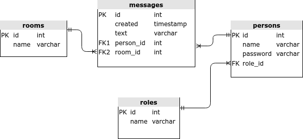

# REST API Chat  
[](https://travis-ci.com/amasterenko/job4j_chat)  

---  
This project demonstrates the principles of following technologies:
- Spring Boot (Web, Data)
- REST API
- PostgreSQL 

### DB Schema:  


  
#### 
- CRUD operations with Role, Person, Room and Message entities.  

### Configuration:    
Create a PostgreSQL database with the name _chat_ and add the credentials to _/resources/application.properties_.
The default ones are :
```
spring.datasource.url=jdbc:postgresql://127.0.0.1:5432/chat
spring.datasource.username=postgres
spring.datasource.password=password
spring.datasource.driver-class-name=org.postgresql.Driver
```

### Usage:  
Build the JAR file with
```
./mvnw clean package
```
and then run the JAR file, as follows:  
```
java -jar target/job4j_chat-1.0.jar
```
After starting the service, visit:  
```
http://localhost:8080/chat
```

###Request examples:
####Role  

_Create_:    
>POST http://localhost:8080/roles/    
>Request body: {"name":"users"}  

_Read_:   
>GET http://localhost:8080/roles/  

_Read by id_:  
>GET http://localhost:8080/roles/id   

_Update_:    
>PUT http://localhost:8080/roles/    
>Request body: {"id":"1", "name":"newusers"}    

_Delete_:  
>DELETE http://localhost:8080/roles/id  

_Person_

_Create_:  
>POST http://localhost:8080/persons/    
>Request body: {"name":"user1", "password":"123", "role":{"id":"1"}}    

_Read_:  
>GET http://localhost:8080/persons/      

_Read by id_:    
>GET http://localhost:8080/persons/id      

_Update_:    
>PUT http://localhost:8080/persons/    
>Request body: {"id":"1", "name":"newusername", "password":"555", "role":{"id":"2"}}  

_Delete_:  
>DELETE http://localhost:8080/persons/id  

####Room

_Create_:    
>POST http://localhost:8080/rooms/   
>Request body: {"name":"Room1"}  

_Read_:  
>GET http://localhost:8080/rooms/  

_Read Room by id_:  
>GET http://localhost:8080/rooms/id  

_Update Room_:    
>PUT http://localhost:8080/rooms/    
>Request body: {"id":"1","name":"newRoom"}  

_Delete Room_:  
>DELETE http://localhost:8080/rooms/id  

####Message

_Create_:    
>POST http://localhost:8080/messages/   
Request body: {"text":"message1", "person":{"id":"1"}, "room":{"id":"1"}}

_Read Messages_:  
>GET http://localhost:8080/messages/

_Read by id_:  
>GET http://localhost:8080/messagess/id

_Read by Room's id_:  
>GET http://localhost:8080/messages/room/id

_Update_:    
>PUT http://localhost:8080/messages/    
Request body: {"id":"1", "text":"newmessage", "person":{"id":"1"}, "room":{"id":"1"}}

_Delete_:  
>DELETE http://localhost:8080/messages/id 