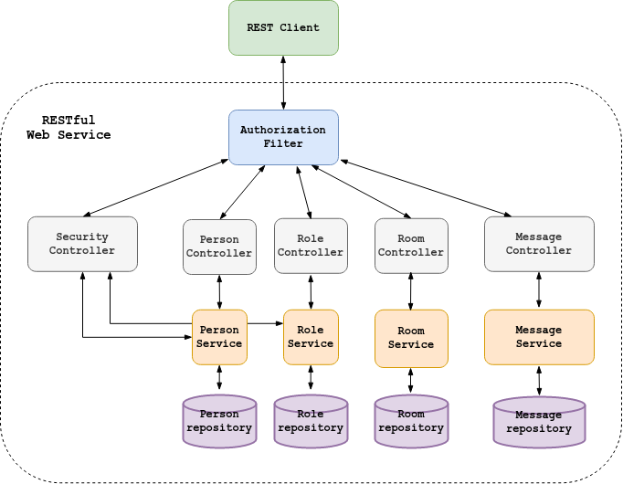

# REST API Chat  
[](https://travis-ci.com/amasterenko/job4j_chat)  

This project demonstrates the principles of the following technologies:
- Spring Boot (Web, Data, Security)  
- REST API  
- JWT  
- PostgreSQL   
- Maven  
- Travis C.I.  

### Features
- User authentication (login/password)
- User authorization (JSON Web Token, Spring Security Framework Roles)
- CRUD operations with Role, Person, Room and Message entities

### Basic diagram of the app  



### DB Schema  


  
### Configuration:    
Create a PostgreSQL database with the name _chat_ and add the credentials to _/resources/application.properties_.
The default ones are :
```
spring.datasource.url=jdbc:postgresql://127.0.0.1:5432/chat
spring.datasource.username=postgres
spring.datasource.password=password
spring.datasource.driver-class-name=org.postgresql.Driver
```
Run _schema.sql_ from _resources/db_ folder.  

### Usage   
Build the JAR file with
```
./mvnw clean package
```
and then run the JAR file, as follows:  
```
java -jar target/job4j_chat-1.0.jar
```
Default server URL:  http://localhost:8080/.  

Endpoints  _/sign-up_ and _/sign-in_ are accessible without authentication.    

#### Person(user) registration:
```
POST http://localhost:8080/sign-up/    
Content-Type: application/json  
Request body: {"name":"userName", "password":"userPassword"}  
``` 

#### Login/password authentication:
```
POST http://localhost:8080/sign-in/  
Header: Content-Type: application/json  
Request body: {"name":"userName", "password":"userPassword"}    
Response header: Authorization: Bearer ___jwtToken___  
```
#### JWT authorization:  
To pass the authorization, the token must be placed in each authorization HTTP-request header.  

#### Role-based authorization:  
There are two built-in roles in the project.  
_ROLE_ADMINS_ has the rights to any operations on the entities.  

_ROLE_USERS_ has the following rights:  

- Roles: no access         
- Rooms: READ  
- Person: READ, UPDATE, DELETE (only for own account)  
- Message: READ (all), CREATE,  UPDATE (only for own account)  


*Built-in admin credentials: _admin/admin_

#### CRUD Role:  

_Create_:    
```
POST http://localhost:8080/roles/  
Header: Content-Type: application/json  
        Authorization: Bearer _jwtToken_  
Request body: {"name":"ROLE_nameOfrole"}  
```
_Read_: 
```
GET http://localhost:8080/roles/  
Header: Authorization: Bearer _jwtToken_  
```

_Read by id_:
```
GET http://localhost:8080/roles/id  
Header: Authorization: Bearer _jwtToken_   
```
_Update_:    
```
PUT http://localhost:8080/roles/   
Header: Content-Type: application/json  
Authorization: Bearer _jwtToken_  
Request body: {"id":"1", "name":"ROLE_newNameOfrole"}    
```
_Delete_:  
```
DELETE http://localhost:8080/roles/id  
Header: Authorization: Bearer _jwtToken_  
```  
#### CRUD Person:

_Create_:  
```
POST http://localhost:8080/persons/   
Header: Content-Type: application/json   
        Authorization: Bearer _jwtToken_  
Request body: {"name":"user1", "password":"123", "role":{"id":"1"}}    
```
_Read_:  
```
GET http://localhost:8080/persons/   
Header: Authorization: Bearer _jwtToken_
```
_Read by id_:   
```
GET http://localhost:8080/persons/id   
Header: Authorization: Bearer _jwtToken_
```
_Update_:    
```
PUT http://localhost:8080/persons/    
Header: Content-Type: application/json   
        Authorization: Bearer _jwtToken_
Request body: {"id":"1", "name":"newusername", "password":"555", "role":{"id":"2"}}  
```
_Delete_:  
```
DELETE http://localhost:8080/persons/id  
Header: Authorization: Bearer _jwtToken_  
```
#### CRUD Room:

_Create_:   
```
POST http://localhost:8080/rooms/   
Header: Content-Type: application/json   
        Authorization: Bearer _jwtToken_
Request body: {"name":"Room1"}  
```
_Read_:  
```
GET http://localhost:8080/rooms/  
Header: Authorization: Bearer _jwtToken_  
```
_Read by id_:  
```
GET http://localhost:8080/rooms/id  
Header: Authorization: Bearer _jwtToken_
```
_Update_:  
```
PUT http://localhost:8080/rooms/    
Header: Content-Type: application/json   
        Authorization: Bearer _jwtToken_
Request body: {"id":"1","name":"newRoom"}  
```
_Delete_:  
```
DELETE http://localhost:8080/rooms/id  
Header: Authorization: Bearer _jwtToken_
```
#### CRUD Message:

_Create_:  
```
POST http://localhost:8080/messages/  
Header: Content-Type: application/json   
        Authorization: Bearer _jwtToken_
Request body: {"text":"message1", "person":{"id":"1"}, "room":{"id":"1"}}
```
_Read_:  
```
GET http://localhost:8080/messages/  
Header: Authorization: Bearer _jwtToken_
```
_Read by id_:  
```
GET http://localhost:8080/messagess/id  
Header: Authorization: Bearer _jwtToken_
```
_Read by Room's id_:  
```
GET http://localhost:8080/messages/room/id  
Header: Authorization: Bearer _jwtToken_
```
_Update_:   
```
PUT http://localhost:8080/messages/    
Header: Content-Type: application/json   
        Authorization: Bearer _jwtToken_  
Request body: {"id":"1", "text":"newmessage", "person":{"id":"1"}, "room":{"id":"1"}}  
```
_Delete_:  
```
DELETE http://localhost:8080/messages/id  
Header: Authorization: Bearer _jwtToken_  
```